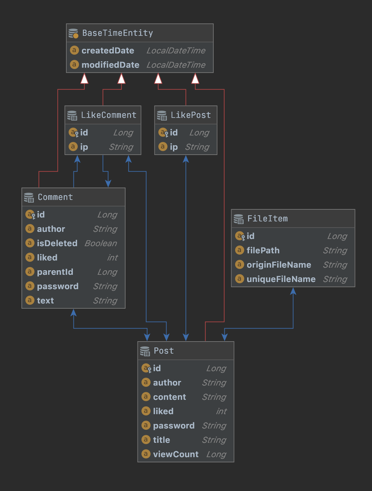

# Yummy Board
> **개발자 `🧑🏻‍💻 영호`** 

😆 프로젝트 링크 : [yummyBoard](http://yummyBoard.site) 

## 사용 기술
   - **Frontend** : Vue.js
   - **Backend** : Spring Boot / JPA
   - **Infra** : AWS EC2 / AWS RDS
   - **형상 관리** : Git

### 데이터베이스 스키마
{: width="150px" height="150px"}

## 프로젝트 기능
 
 + 게시글 
    + CRUD V
    + 파일 업로드 V
    + 댓글 V
    + 대댓글 V
    + 좋아요 V
    + 조회수 카운팅 V
  + 페이징 V
  + 게시글 검색 V
  + 정렬(좋아요순, 날짜순, 조회순) V

---
#### :pencil2: 개발 과정 중 얻은 지식 모음
- [지식모음](issue.md)
